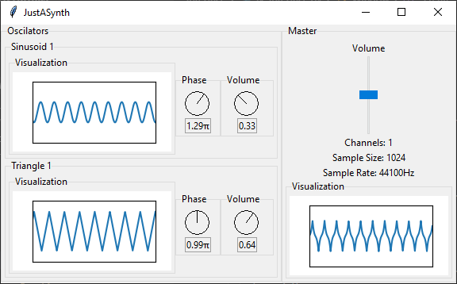

# pywaves [](https://travis-ci.org/raphaelpaiva/pywaves)
A Python Midi-capable Software Synthesizer



Requirements
------------
### Python Version: 3.6+

### **Notice**: PortAudio dependency
**TL;DR**: You may need to `apt install libportaudio2` or the equivallent in your distro.

This project uses [python-sounddevice](https://github.com/spatialaudio/python-sounddevice), a [PortAudio](http://www.portaudio.com/) binding library. sounddevice is installed via `requirements.txt`, but PortAudio may need to be installed in your system. It is compatible with Windows out-of-the box, but not with some Linux distros, but it is not hard to find it in your package manager.

---

With that out of the way, just use pip:

```pip install -r requirements.txt```

Running
-------

```bash
$ python app.py
```

For more options:

```bash
$ python app.py --help
```

Main goals are:
  * To learn :)
  * To have fun :D
  * To play with some dirty psychedelic sounds...
  * ...And visualize them!

Main Application goals are:
  * Have a nice API to work with sound generation
    - heavily inspired in [ThinkDSP's work](https://github.com/AllenDowney/ThinkDSP)
  * Have a simple UI to (in real time):
    - Create and control Sinusoid wave sounds
    - Combine them
    - Control them
    - Visualize them
